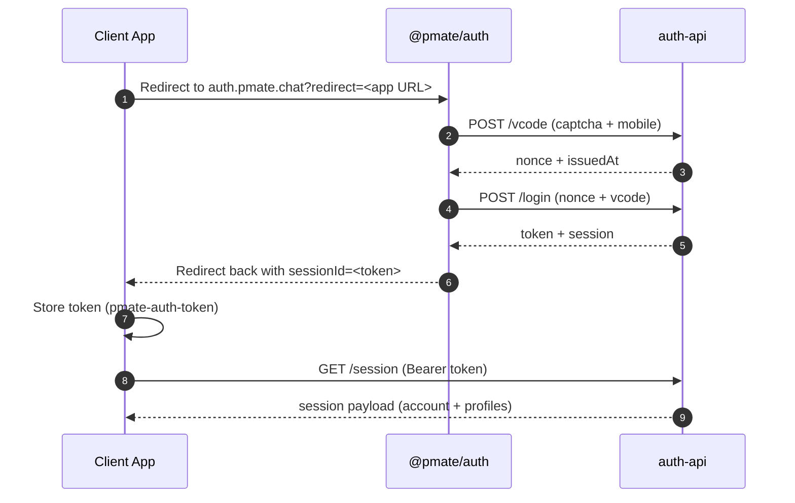

# Auth API 快速开始

使用托管登录 UI 或直接调用 API，让客户端完成 `auth-api` 认证。

## 目录

- [背景](#背景)
- [核心概念](#核心概念)
- [快速开始流程（托管 UI）](#快速开始流程托管-ui)
- [快速开始流程（直接调用 API）](#快速开始流程直接调用-api)
- [/session 返回内容](#session-返回内容)
- [前端必备环境变量](#前端必备环境变量)
- [说明](#说明)

## 背景

认证接入常见的问题是流程不一致、UI 逻辑重复、会话状态分散，结果是上手慢且容易出现边界 bug。不同客户端各自实现细节时，成本会被不断放大。

本快速开始明确了 `auth-api` 的推荐接入路径，无论是使用托管 UI 还是自建 UI，都能沿着一致的步骤完成登录与会话建立，降低接入复杂度。

该服务以统一的 account/profile 模型和会话生命周期为基础。遵循本指南有助于在不同端保持身份语义一致，并减少后续权限与上下文同步问题。

## 核心概念

- Account：与手机号绑定的主身份，一个 account 可以拥有多个 profile。
- Profile：account 下的工作身份（例如不同组织或角色）。
- 关系：account -> 多个 profile。会话针对 account 签发，应用可切换当前 profile。
- App：业务应用的标识（app 字符串），用于加载应用级配置（名称、Logo 等）并区分不同客户端。

## 快速开始流程（托管 UI）

推荐用于 Web 应用。

1. 将用户重定向到托管登录页：
   - `https://auth.pmate.chat?redirect=<encoded_return_url>`
2. 回跳后，从 URL 读取 `sessionId` 并保存为 auth token。
3. 调用 `GET /session` 获取 account 与 profiles，并选择当前 profile。

## 快速开始流程（直接调用 API）

当你使用自建 UI 时采用此方式。

1. `POST /captcha/verify` 校验验证码 token。
2. `POST /vcode`，携带 `mobile`、`purpose` 与验证码证明。
3. `POST /login`，传 `{ nonce, issuedAt, body: { type: "sms", mobile, vcode } }`。
4. 保存 `token`（例如 `pmate-auth-token`）并在请求中携带。
5. `GET /session` 获取 account + profiles。

## /session 返回内容

- account：主身份信息（手机号、id、状态）。
- profiles：该 account 下的可用 profiles 列表。
- identity：当前鉴权上下文；当前 profile 由应用选择。

## 前端必备环境变量

- `VITE_PUBLIC_AUTH_SERVER_ENDPOINT`（auth-api 基础地址）。
- `VITE_PUBLIC_ACCOUNT_SERVICE`（使用 account service API 时需要）。

## 说明

- `auth-api` 在发短信前会强制校验验证码。
- 保存 token 后请清理 URL 中的 `sessionId` 参数。
- 注册新 App 需手动提供给管理员：`app`（string 标识）、`appname`、`logo`（参考 `packages/account-sdk/src/app.config.ts` 的 `id`、`name`、`icon` 字段）。
