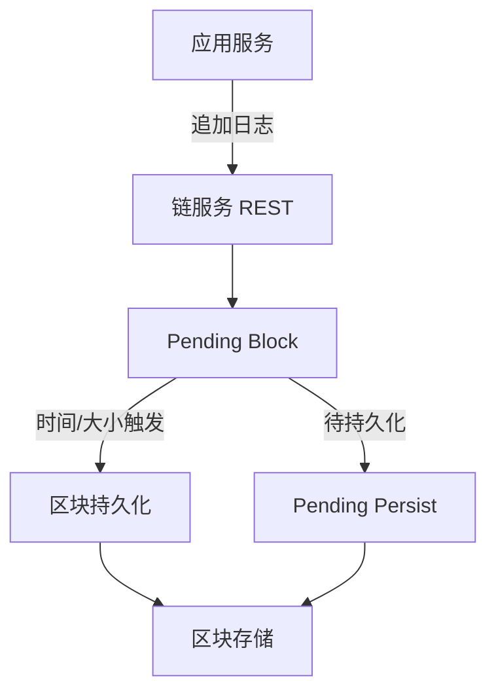
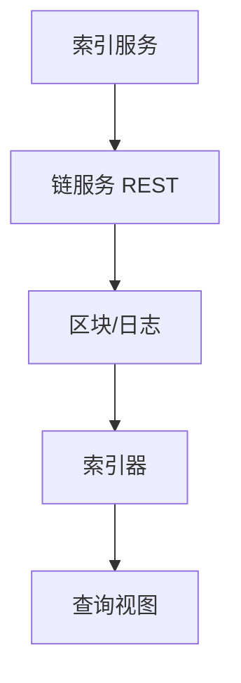

# 如何理解 blockchain 与 indexer？

这是一篇技术分享性质的概览，基于目前的 Rust 实现，介绍链服务与索引服务如何协作。

We treat AI behavior as immutable facts, and derive multiple evolving read models from them.

## 目录

- [Background/背景](#background背景)
- [什么是 Blockchain](#什么是-blockchain)
- [什么是 Indexer](#什么是-indexer)
- [链服务（写入路径）](#链服务写入路径)
- [索引服务（读取路径）](#索引服务读取路径)
- [表索引器（StdTable 示例）](#表索引器stdtable-示例)
- [与传统数据库的对比](#与传统数据库的对比)
- [小结](#小结)
- [AI + 社交场景下的优势与劣势](#ai-社交场景下的优势与劣势)

## Background/背景

业务通常需要“可靠写入 + 方便查询”的组合。pmate 的做法是将写入路径交给链服务（append-only 日志），把查询能力交给索引服务（读模型）。这样写入逻辑保持稳定，读模型可以持续演进。

链服务专注吞吐与持久化：日志写入后按时间或大小打包成区块并持久化，不做复杂查询。索引服务专注读性能：消费区块日志，按不同索引类型生成可查询视图（表、map 等）。

这种拆分也降低了运维复杂度。链服务可以独立做存储与吞吐优化；索引服务可以按 chainId 增减或调整索引器，而不影响写入路径。两者通过 HTTP 连接，并以 chainId 作为隔离边界。

举个量级例子：如果每天写入约 100 万～500 万条日志，链服务仍然保持顺序写入，而索引服务可以构建表/Map/搜索等视图。原本需要扫描百万级日志的读取，变成对行存储或 KV 的直接查询。

一句话：写入只走链服务，读取走索引服务。

## 什么是 Blockchain

在 pmate 语境下，“blockchain” 并不是公链或加密网络，而是内部的追加写日志链服务：

- **只追加**：客户端只写入日志，历史不可变更。
- **区块**：日志按时间/大小分组为区块，便于存储与流式消费。
- **Chain ID**：每条链以 `chainId` 隔离，并有独立配置。

可以把它理解为带区块语义的可靠事件日志，索引服务从中构建查询视图。

## 什么是 Indexer

Indexer 是读侧服务，把链日志转换成可查询的数据视图：

- **消费日志**：从链服务拉取区块与 pending 数据。
- **构建视图**：生成表 / map / 搜索等读模型，支持快速查询。
- **可重建**：视图逻辑升级或数据异常时，可从链日志重新构建。

可以把它理解为“基于日志的物化视图引擎”。

## 链服务（写入路径）

链服务的核心流程：

- 通过 `chainId` 加载链配置（区块时间、最大区块大小、pending 持久化间隔）。
- 将日志写入 **pending block**。
- 达到时间或大小阈值时生成新区块并持久化。
- 对外提供区块与链信息的 HTTP 接口。

从实现细节看：

- 写入支持批量追加，并对特殊日志（如 delete）做校验。
- pending block 在内存中累积，`pending_persist_time` 可触发周期性持久化。
- 通过 `latest_block_id` 维持单调递增，并可返回 pending block。



## 索引服务（读取路径）

索引服务负责把日志变成可查询数据：

- 从 `INDEXER_CONFIG` 读取配置，为每个 `chainId` 创建 **chain worker**。
- 每个 worker 用 `BlockStream` 定时拉取区块与 pending block。
- 日志按类型分发给不同 indexer（如 `table_indexer`、`map_indexer`）。
- 每个 indexer 输出自己的 **manifest**，声明可用的查询动作与参数。

`BlockStream` 会维护游标与时间缓存，避免 pending block 导致的重复日志。



## 表索引器（StdTable 示例）

以表索引为例：

- 消费 `StdTable` 日志，并维护 **分页存储** 与 **行存储**（按 `topic + id`）。
- `create` 写整行，`update` 写增量，`delete` 移除行。
- `page` 返回分页结果（数据 + 元信息）。
- `get_by_id` / `exists` 直接查行存储。

因此能同时支持分页读取与快速主键查找。

## 与传统数据库的对比

pmate 的链 + 索引模型接近“事件日志 + 物化视图”的架构。它把写入与读取拆开：写入路径稳定、追加式；读取路径按需构建视图，强调查询效率与可演进性。

在传统数据库（MySQL / Postgres）中，读写共享同一存储与模型，强一致性与事务能力是优势，但在高吞吐、频繁演进或需要多种读模型时，扩展成本会变高。pmate 的选择是牺牲即时一致性，换取写入稳定性与读模型灵活度。

文档数据库（MongoDB）擅长灵活 schema 与文档查询，但读写依然耦合在同一存储层。当你需要“一个写入、多种查询视图”时，pmate 的索引器更容易按场景拆分与重建。

时序数据库强调时间序列写入和聚合分析，适合指标与日志类场景。pmate 的日志同样具备时间序列特征，但索引器能把日志映射成实体视图（表 / map），更适合业务实体的 CRUD 查询。

适合场景：需要稳定写入路径、读模型可独立演进、并且接受最终一致性的系统。

## 小结

- 链服务是日志写入的“单一事实来源”。
- 索引服务把日志转成“可查询视图”。
- 两者以 `chainId` 为边界，通过 HTTP 协作。

这套架构便于扩展索引类型，不需要改写写入路径，非常适合多服务快速迭代的场景。

## AI + 社交场景下的优势与劣势

在 AI + 社交场景里，判断“blockchain + indexer 是否合适”，关键不在于概念本身，而在于：系统的真实数据形态是什么、哪些信息必须长期保留、哪些能力可以按需重建。

AI App 的核心数据通常不是“表”，而是 **事件流（append-only event）**：用户说了什么、AI 在什么上下文下生成了什么、推荐为什么是这样、模型版本升级后行为如何变化……这些都更接近“事实发生”，而不是“状态更新”。

因此链服务的定位非常明确：它是 **Single Source of Truth for AI Behavior（AI 行为的单一事实来源）**。读模型可以被丢弃并重建，但事实链必须可靠、可追溯、可验证；否则系统很难解释与复盘，也很难持续演进。

下面从收益与工程边界两个维度展开。

### 优势：更贴合 AI + 社交的真实工作流

1. **可解释与可回放（Debug/复盘的底座）**  
   以每天 500 万条事件为例：消息、工具调用、推荐曝光、点击、反馈、模型版本、提示词/上下文摘要等。如果只保留“最终状态”，系统很难回答“为什么这条回复这么生成”“为什么某次升级后推荐变差”。  
   采用 append-only 的事实源后，可以按时间回放某段会话或某个用户的完整事件序列，把问题收敛到“上下文 / 模型 / 索引器 / 规则”的责任边界。

2. **读模型按产品复杂度拆分，而不是被单库拖着跑**  
   AI + 社交一旦做深，查询需求会快速分化：feed、关系图、搜索、embedding、统计、实时订阅……这些不是一张表能承载的。索引器的价值在于：同一条写入日志可以被不同 indexer 消费，生成各自最合适的读模型与存储形态。

3. **写入稳定，读侧可演进（更适合快速迭代）**  
   AI 产品的读逻辑变化速度通常远高于写逻辑：团队可能每周迭代一次 feed 排序、每两周升级一次 embedding 方案、随时加一个新“解释面板”。写入只负责追加事件，索引器负责演进视图，降低“改读逻辑就要动写入/迁移大表”的风险。

### 代价与边界：需要明确的工程取舍

1. **Indexer 数量 ~= 产品复杂度平方增长**  
   这通常是正确方向（每个查询场景都有最合适的读模型），但代价同样清晰：运维复杂度、回放/重建成本、以及“多个读模型之间的一致性验证”都会上升。  
   工程上建议尽早建立两项能力：  
   1) **indexer versioning**：读模型变更可区分版本，支持灰度/回滚。  
   2) **indexer rebuild automation**：将“从某个 block 重建”标准化、自动化，避免依赖人工救火。

2. **最终一致性（eventual correctness），不是强事务（atomic correctness）**  
   跨实体操作很常见，比如：发送消息 + 更新会话列表 + 更新 unread，或者：AI 回复 + 计费扣 token + 更新 quota。  
   在这套模型里，更接近“弱事务”：写入按事件顺序发生，读模型短时间可能不同步，正确性通过补偿事件与重放来保证。  
   这在 AI App 往往可接受（体验可容忍短暂滞后），但在金融/强一致领域通常不可接受。

3. **查询延迟的体验设计需要配合**  
   如果索引滞后 1～3 秒，用户端需要有相应的 UX 策略：例如先展示本地乐观状态，再由读模型刷新纠正；或者把“刚写入”与“已可查询”做明确区分，避免产生“写入成功但搜不到”的误解。

### Case Study：为什么 MySQL 很快会扛不住「对话 + 推荐 + 回放」

场景：AI 社交 App 的「对话 + 推荐 + 回放」，例如 AI 助手 / AI 角色 / AI 群聊 / AI 陪伴。用户每天与 AI 产生大量交互，系统要做的不只是“存聊天记录”，而是支持解释、回放与持续演进。

一个看起来很普通的需求：

1. 用户和 AI 对话，能看到历史消息
2. 能推荐「你可能想继续聊的对话」
3. 模型升级后，能回放旧对话并重新生成 AI 回复
4. 能分析：为什么这个推荐/回复会出现

#### 传统做法（MySQL）：常见起步方式

一个常见的起步方案是采用类似表结构（简化）：

```sql
conversations(id, user_id, last_message_at)
messages(id, conv_id, role, content, created_at)
ai_responses(id, message_id, model, prompt, output)
recommendations(user_id, conv_id, score, updated_at)
```

这种方案在早期推进很快，但很快会遇到三类结构性问题：

1. **AI 行为被“状态化”了**  
   当最终只存 `ai_responses.output = "..."` 时，“事实链条”往往会缺失：当时 prompt 是什么、上下文包含哪些消息、模型参数是什么、当时的 embedding/ranking 逻辑是什么。系统只保留结果，却难以解释“为什么会得到这个结果”。

2. **模型升级会把“数据债”放大**  
   当产品提出“换了更好的模型，希望老对话也能重新生成 AI 回复”时，MySQL 方案容易演变为：加字段、加表、批量 UPDATE、一次性脚本、不可回滚操作、历史版本难以并存。更关键的是：很难保证“当时的上下文 + 当时的配置”能够被完整重现。

3. **推荐系统会被“读模型耦合”拖慢**  
   推荐往往依赖：最近消息、对话频率、AI 互动质量、用户行为序列。工程演进中常见的结果是：JOIN 越来越重、离线 ETL 越来越多、并形成大量“这张表别动”的约定。系统可以产出结果，但很难对历史重跑，也很难对比不同算法/模型版本的效果差异。

#### chain + indexer：把“事实”与“读模型”分层

核心原则：**写入只记录不可变事实**，避免把复杂业务语义压到“更新状态”的 SQL 上。

写入（链服务）示意：

```json
{ "type": "user_message", "userId": 1, "convId": 9, "text": "hi" }
{ "type": "ai_response", "model": "gpt-4.5", "prompt": "...", "output": "hello" }
{ "type": "conv_read", "userId": 1, "convId": 9 }
```

然后从同一条事实源派生多个读模型（indexer），按场景分别演进：

1. **读模型 1：对话列表 / 历史消息（StdTable/Table indexer）**  
   维护分页、最新消息、未读数等视图，体验上等价于传统的 `conversations/messages`，但来自可回放的事实链。

2. **读模型 2：推荐 indexer（独立演进）**  
   消费同样的事件流，构建“用户 -> 对话权重/活跃度/互动密度”等结构。算法变了就升级 indexer，不需要碰写入链路，也不需要大规模迁移主表。

3. **读模型 3：回放/评估 indexer（模型升级的标准动作）**  
   对同一批历史事件，在新模型/新参数下重跑，生成“新回复 + 旧 vs 新差异 + 评估指标”。这是一种“把模型升级变成可控工程”的方式，而不是一次性脚本。

结论：在 AI + 社交产品里，最有价值的资产不是“最终状态”，而是“行为事实”。链服务把事实可靠地收进来，索引器把事实解释成各种读模型，让系统在持续演进中保持可解释、可回放与可重建。
