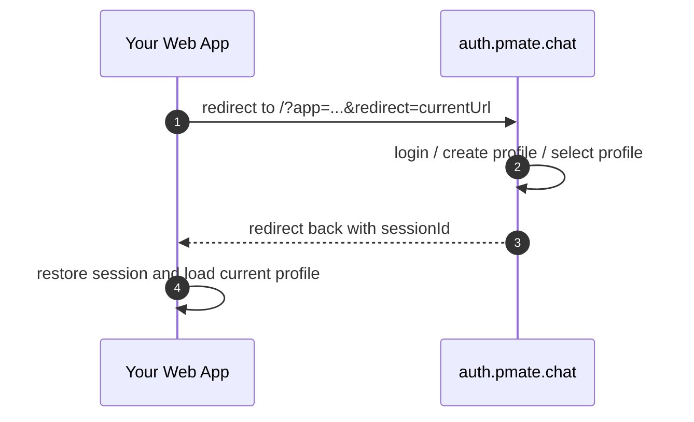

# Web 接入 Account System

浏览器应用接入 Pmate 认证体系时，推荐优先使用托管在 `https://auth.pmate.chat` 的登录与 Profile 管理流程。Web 应用只需要决定哪些页面需要登录、在何时跳转，以及如何读取当前登录态与 Profile。

这篇文档不再展开认证原理，而是聚焦“如何接入”。如果你是普通 Web 应用，优先选择 URL 登录模式；如果你是 React 应用，推荐直接接 `@pmate/account-sdk`，效果与 URL 登录模式一致，但接入成本更低。

## 目录

- [Background/背景](#background)
- [推荐接入方式](#recommended-integration)
- [URL 登录模式（推荐）](#url-login)
- [React SDK 登录模式（仅 React）](#react-sdk-login)
- [Profiles 管理](#profiles-management)
- [主题颜色、Icon 与 Profile 项定义](#app-branding)
- [什么时候才考虑 auth-api](#when-to-use-auth-api)

<a id="background"></a>
## Background

Pmate 的登录、创建 Profile、切换 Profile、编辑 Profile，建议统一放到 `auth.pmate.chat` 上完成。这样不同应用的登录体验和 Profile 管理体验保持一致，应用侧只需要处理“跳过去”和“跳回来以后继续工作”。

对大多数 Web 应用来说，直接对接 `auth-api` 并不是推荐路径。更重要的原因不是“今天能不能接”，而是“后面怎么演进”。认证体系后续会逐步支持 Google、微信、GitHub 等更多登录方式，如果各个应用都自己对接 `auth-api`，就需要分别补 UI、补流程、补回跳逻辑；而统一走 `auth.pmate.chat`，前端入口和交互可以始终保持一套。

<a id="recommended-integration"></a>
## 推荐接入方式

- 普通 Web 应用：优先使用 URL 登录模式。
- React 应用：优先使用 `@pmate/account-sdk`。
- CLI 应用：推荐拉起浏览器，或者在可行时使用 WebView 打开 `auth.pmate.chat` 完成登录，再回传登录结果。
- React Native 应用：推荐使用 WebView 打开 `auth.pmate.chat` 完成登录和 Profile 管理。
- Native 应用：推荐使用 WebView 打开 `auth.pmate.chat` 完成登录和 Profile 管理。
- 只有在你必须自建整套登录 UI，或者不是浏览器 React 应用时，才考虑直接对接 `auth-api`。

可以把这些推荐模式理解成同一个托管认证入口在不同端上的接法：

- Web URL 登录模式：你自己拼跳转 URL，手动处理回跳。
- React SDK 登录模式：SDK 帮你完成跳转、回跳恢复、受保护路由拦截与 Profile 引导。
- CLI / React Native / Native：核心思路仍然是打开 `auth.pmate.chat`，只是在宿主容器里用浏览器或 WebView 承载。

<a id="url-login"></a>
## URL 登录模式（推荐）

这是最通用、也最推荐的接法。核心思路很简单：需要登录时跳到 `auth.pmate.chat`，完成登录后再跳回你的业务页面。

### 1. 跳转到托管登录页

登录入口跳转到：

```text
https://auth.pmate.chat?app=<your-app-id>&redirect=<current-url>
```

其中：

- `app`：当前应用标识。
- `redirect`：登录完成后回跳的页面地址，通常就是当前页面 URL。

例如：

```ts
const url = new URL("https://auth.pmate.chat")
url.searchParams.set("app", "@your/app")
url.searchParams.set("redirect", window.location.href)
window.location.assign(url.toString())
```

### 2. 在 `auth.pmate.chat` 完成登录

用户跳转过去后，登录、创建 Profile、选择 Profile 等动作都在托管页面完成。应用侧不需要自己实现手机号登录流程，也不需要自己拼 Profile 创建页。

### 3. 登录完成后回跳

登录完成后，认证站会跳回你传入的 `redirect`，并把 `sessionId` 放到 URL 上。流程可以理解为：



### 4. 回跳后恢复登录态

应用在回跳页面需要做两件事：

1. 从 URL 读取 `sessionId`
2. 用 `sessionId` 恢复当前 session，并清理 URL 参数

如果你不是 React，或者不使用 `@pmate/account-sdk`，就需要自己完成这一层逻辑。

<a id="react-sdk-login"></a>
## React SDK 登录模式（仅 React）

如果你的应用是 React，推荐直接使用 `@pmate/account-sdk`。它本质上还是 URL 登录模式，只是 SDK 已经帮你做了这些事：

- 发现受保护页面未登录时，自动跳到 `auth.pmate.chat`
- 从回跳 URL 中读取 `sessionId`
- 恢复 account / profile 状态
- 用户已登录但还没有 Profile 时，自动进入创建 Profile 流程

### 1. 安装

```bash
npm install @pmate/account-sdk
```

应用侧需要提供这些依赖：

- `react`
- `react-router-dom`
- `jotai`
- `jotai-family`

### 2. 用 `AuthProviderV2` 包裹路由

```tsx
import { AuthProviderV2 } from "@pmate/account-sdk"
import { BrowserRouter, Route, Routes } from "react-router-dom"

const authRoutes = [
  { path: "/chat", behavior: "redirect" },
  { path: "/settings", behavior: "redirect" },
]

export const App = () => (
  <BrowserRouter>
    <AuthProviderV2 app="@your/app" authRoutes={authRoutes}>
      <Routes>
        <Route path="/" element={<HomePage />} />
        <Route path="/chat" element={<ChatPage />} />
        <Route path="/settings" element={<SettingsPage />} />
      </Routes>
    </AuthProviderV2>
  </BrowserRouter>
)
```

这里最重要的是两个参数：

- `app`：当前应用标识，必须和认证系统里的应用配置对应。
- `authRoutes`：哪些路由需要登录。

### 3. 受保护路由的行为

`authRoutes` 支持两种行为：

- `redirect`：未登录时直接跳去登录，推荐用于必须登录才能访问的页面。
- `prompt`：未登录时先弹一个提示层，再让用户决定是否登录。

示例：

```tsx
const authRoutes = [
  { path: "/chat", behavior: "redirect" },
  { path: "/profile", behavior: "prompt" },
  "/dm/:toId",
]
```

### 4. 手动触发登录、退出和 Profile 流程

有些页面你可能不想完全依赖路由守卫，而是希望自己放一个“登录”或“切换 Profile”按钮。这时直接用 `useAuthApp`：

```tsx
import { useAuthApp } from "@pmate/account-sdk"

const AccountActions = () => {
  const { login, logout, createProfile, selectProfile, updateProfile } =
    useAuthApp({ app: "@your/app" })

  return (
    <div>
      <button onClick={() => login()}>登录</button>
      <button onClick={() => createProfile()}>创建 Profile</button>
      <button onClick={() => selectProfile()}>切换 Profile</button>
      <button onClick={() => updateProfile({ step: "nickname" })}>
        编辑 Profile
      </button>
      <button onClick={() => logout()}>退出登录</button>
    </div>
  )
}
```

这些方法最终跳转到的仍然是 `auth.pmate.chat`：

- `login()` -> `/`
- `createProfile()` -> `/create-profile`
- `selectProfile()` -> `/select-profile`
- `updateProfile()` -> `/edit-profile`
- `logout()` -> `/logout`

### 5. 读取当前登录态和当前 Profile

应用侧常用的读取方式如下：

```tsx
import { useAtomValue } from "jotai"
import { accountStateAtom, profileAtom } from "@pmate/account-sdk"

const CurrentUser = () => {
  const account = useAtomValue(accountStateAtom)
  const profile = useAtomValue(profileAtom)

  if (!account) return <div>未登录</div>
  if (!profile) return <div>已登录，但还没有选中 Profile</div>
  return <div>{profile.nickName}</div>
}
```

<a id="profiles-management"></a>
## Profiles 管理

Web 应用里不要自己再实现一套完整的 Profiles 管理页。推荐做法是：

- 登录在 `auth.pmate.chat` 完成
- 创建 Profile 在 `auth.pmate.chat` 完成
- 编辑 Profile 在 `auth.pmate.chat` 完成
- 切换 Profile 在 `auth.pmate.chat` 完成

应用侧通常只做两件事：

- 展示当前 Profile 信息
- 在合适的地方提供“去管理”的入口

如果你的业务里有 `/profile` 页面，这个页面建议只做业务展示或轻量入口，不要再复制一套托管站已经有的资料编辑流程。

<a id="app-branding"></a>
## 主题颜色、Icon 与 Profile 项定义

登录页、退出页、Profile 创建页上看到的应用名称、图标、背景和 Profile 收集项，来自应用配置，而不是业务页面临时传参。

当前配置定义在：

- `packages/account-sdk/src/app.config.ts`

一个应用配置包含这些核心字段：

```ts
export interface AppConfig {
  id: string
  name: string
  icon: string
  background: string
  themeColor?: string
  welcomeText: string
  profiles: ProfileStep[]
}
```

其中最常用的是：

- `name`：应用展示名
- `icon`：登录页和退出页展示的图标
- `background`：认证页背景
- `themeColor`：应用主色
- `profiles`：创建或编辑 Profile 时需要填写的字段

`profiles` 里的每一项定义了一个 Profile 步骤，例如：

```ts
profiles: [
  { type: "learning-language", title: "Learning Language", required: true },
  { type: "nickname", title: "Nickname", required: true },
]
```

也就是说，如果你想调整：

- 登录页品牌样式
- 应用 icon
- Profile 创建时展示哪些字段
- 字段标题和是否必填

应该修改或登记应用配置，而不是要求业务前端页面自己接管这部分流程。

<a id="when-to-use-auth-api"></a>
## 什么时候才考虑 auth-api

不推荐直接接 `auth-api` 的核心原因，是认证方式会持续扩展。未来如果增加 Google、微信、GitHub 等登录方式，统一走 `auth.pmate.chat` 时，业务应用基本不需要改前端流程；如果每个应用都自己接 `auth-api`，就需要分别重做登录入口、按钮、表单和回跳处理。

只有下面这些情况，才建议直接接 `auth-api`：

- 你不是浏览器应用，无法直接复用托管登录页
- 你必须自建完整登录 UI
- 你有明确的产品要求，需要偏离托管流程

除此之外，Web 应用请优先使用：

- URL 登录模式
- React 场景下的 `@pmate/account-sdk`

这样可以把登录、Profile 管理和品牌配置统一收口到 `auth.pmate.chat`，应用本身只保留最少的接入代码。
