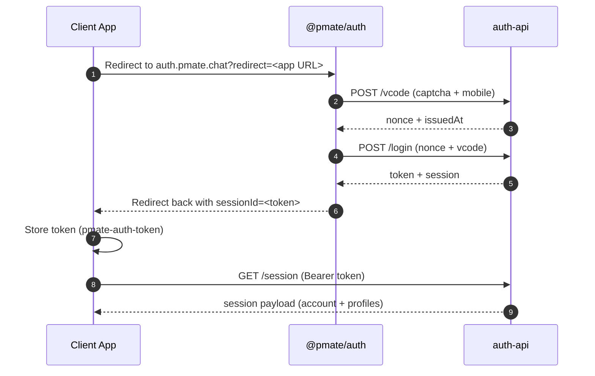

# Auth API Quick Start

Get a client app authenticated with `auth-api` using the hosted login UI or direct API calls.

## Table of Contents

- [Background](#background)
- [Key Concepts](#key-concepts)
- [Quick Start Flow (Hosted UI)](#quick-start-flow-hosted-ui)
- [Quick Start Flow (Direct API)](#quick-start-flow-direct-api)
- [What You Get From /session](#what-you-get-from-session)
- [Required Env (Frontend)](#required-env-frontend)
- [Notes](#notes)

## Background

Auth integration often breaks down into inconsistent login flows, duplicated UI logic, and multiple sources of session truth. That slows teams down and causes subtle bugs when different clients implement slightly different steps.

This quick start defines the intended path for integrating with `auth-api`, whether you use the hosted UI or a custom front end. The goal is to provide a predictable sequence so teams can onboard faster and keep their auth surface area small.

Behind the API is a shared account model that supports multiple profiles and a unified session lifecycle. Following this guide helps ensure that sessions, profiles, and app identity stay aligned across web, mobile, and internal tools.

## Key Concepts

- Account: the primary identity tied to a phone number. One account can own multiple profiles.
- Profile: a workspace persona under an account (for example different orgs or roles).
- Relation: account -> many profiles. Sessions are issued for the account and can switch active profile.
- App: a client app identifier (`app` string) used to load app-level config (name, logo, etc) and distinguish clients.

## Quick Start Flow (Hosted UI)

Recommended for web apps.

1. Send users to the hosted login UI:
   - `https://auth.pmate.chat?redirect=<encoded_return_url>`
2. On return, read `sessionId` from the URL and store it as the auth token.
3. Call `GET /session` to get the account and profile list, then pick an active profile.

## Quick Start Flow (Direct API)

Use this when you build your own UI.

1. `POST /captcha/verify` to validate the captcha token.
2. `POST /vcode` with `mobile`, `purpose`, and captcha proof.
3. `POST /login` with `{ nonce, issuedAt, body: { type: "sms", mobile, vcode } }`.
4. Store `token` (for example `pmate-auth-token`) and include it in requests.
5. `GET /session` to load account + profiles.

## What You Get From /session

- account: the main identity (phone, id, status).
- profiles: list of available profiles under the account.
- identity: current auth context; the active profile is selected by the app.

## Required Env (Frontend)

- `VITE_PUBLIC_AUTH_SERVER_ENDPOINT` (auth-api base URL).
- `VITE_PUBLIC_ACCOUNT_SERVICE` (if your app uses account service APIs).

## Notes

- `auth-api` enforces captcha before issuing SMS codes.
- Always clear `sessionId` from the URL after storing the token.
- To register a new app, manually provide the admin with `app` (string id), `appname`, and `logo` (see `packages/account-sdk/src/app.config.ts` `id`, `name`, `icon`).
