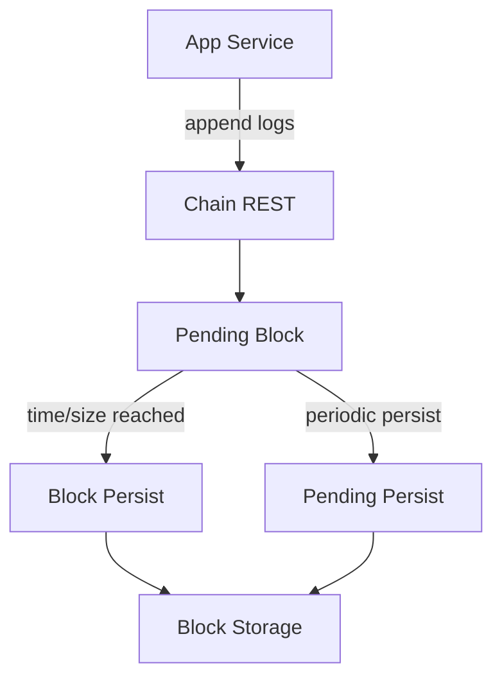
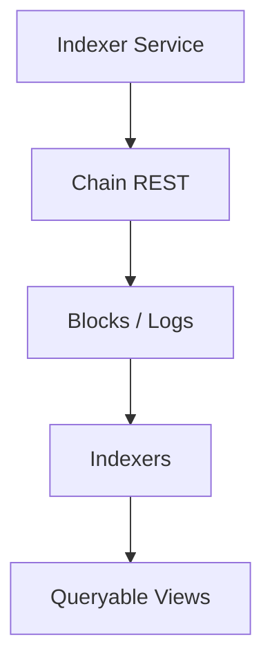

# How to understand blockchain and indexer?

This is a tech-sharing overview of how the chain service and indexer service work together in the pmate stack, based on the current Rust implementation.

We treat AI behavior as immutable facts, and derive multiple evolving read models from them.

## Table of Contents

- [Background/背景](#background背景)
- [What is Blockchain](#what-is-blockchain)
- [What is Indexer](#what-is-indexer)
- [Chain service (write path)](#chain-service-write-path)
- [Indexer service (read path)](#indexer-service-read-path)
- [StdTable indexer (example)](#stdtable-indexer-example)
- [Compare with traditional databases](#compare-with-traditional-databases)
- [AI + social: where this architecture fits (and what it costs)](#ai-social-where-this-architecture-fits-and-what-it-costs)
- [Summary](#summary)

## Background/背景

Teams often need a reliable write path with a fast, queryable read model. In pmate, the chain service provides an append-only log store with block batching, while the indexer service builds read models on top. This separation keeps writes simple and consistent and allows the read side to evolve independently.

The chain is optimized for ingestion: logs are appended, grouped into blocks by time or size, and persisted. It does not attempt complex queries. The indexer is optimized for reads: it consumes the chain’s blocks and produces index-specific views such as tables or maps.

This design also helps operationally. Chain storage can be tuned for durability and throughput; indexers can be added or reconfigured per chain without changing the write path. The two services communicate over HTTP and are loosely coupled by chain id.

For example, if you ingest ~1–5 million logs per day, the chain service can keep a sequential write pattern while indexers build targeted views (table/map/search) without scanning the full log history for each query. A single read that would otherwise touch millions of log entries becomes a direct lookup in a row/KV store.

In short: write once to the chain, read many ways through the indexer.

## What is Blockchain

In the pmate context, “blockchain” is not a public crypto network. It is an internal append-only log chain service:

- **Append-only**: clients only append logs; history is immutable.
- **Blocks**: logs are grouped into blocks by time/size for storage and streaming.
- **Chain id**: each chain is isolated by `chainId` and has its own config.

You can treat it as a durable event log with block semantics. The indexer reads from it to build queryable views.

## What is Indexer

The indexer is the read-side service that turns chain logs into queryable data:

- **Consumes logs** from the chain (blocks + pending updates).
- **Builds views** (table/map/search) tailored for fast queries.
- **Rebuildable**: if a view is corrupted or needs new logic, it can be rebuilt from chain logs.

Think of it as a materialized-view engine over an append-only log.

## Chain service (write path)

At a high level, the chain service:

- Loads chain config by `chainId` (block time, max block size, pending persist interval).
- Buffers logs into a **pending block**.
- Flushes a block when it is full (size) or old enough (time).
- Persists blocks and exposes block info via HTTP.

Important behaviors from the Rust implementation:

- Logs are appended in batches and validated (e.g., delete logs are special-cased).
- A **pending block** stays in memory and may be periodically persisted if `pending_persist_time` is set.
- The chain keeps a monotonically increasing `latest_block_id` and can return the pending block alongside completed blocks.



## Indexer service (read path)

The indexer service turns chain logs into queryable data:

- It loads indexer configs from `INDEXER_CONFIG` and creates **chain workers** per `chainId`.
- Each worker maintains a `BlockStream` that polls the chain for new blocks and pending updates.
- Logs are dispatched to individual indexers (`table_indexer`, `map_indexer`, etc.).
- Each indexer implements a **manifest** describing supported actions and parameters.

The `BlockStream` keeps a cursor and deduplicates logs using timestamps and hash caching to avoid reprocessing logs from overlapping pending blocks.



## StdTable indexer (example)

The table indexer demonstrates the general pattern:

- It consumes `StdTable` logs and maintains a **page store** plus a **row store** keyed by `topic + id`.
- `create` upserts a full row, `update` applies partial changes, `delete` removes the row.
- `page` returns a page response (data + page metadata).
- `get_by_id` and `exists` read directly from the row store.

This separation allows paginated reads and direct lookup without scanning the whole log history.

## Compare with traditional databases

pmate’s chain + indexer model is closest to an event-log + materialized-views architecture (CQRS-like): the write path is append-only and authoritative, while read models are derived and can be rebuilt.

In a traditional relational database (MySQL/Postgres), reads and writes share the same storage and schema. Strong transactions and immediate read-after-write semantics are a major advantage, but the cost of evolving schemas, scaling high-throughput ingestion, and supporting multiple specialized query patterns can rise quickly.

Document databases (MongoDB) make schema evolution easier, but reads and writes are still coupled to the same store. When the product needs “one write stream, many different read views”, you often end up adding ETL, secondary systems, or special-case pipelines.

Time-series databases excel at time-ordered ingestion and aggregations for telemetry. pmate’s logs also have a time-series nature, but indexers can turn that log into entity-centric views (table/map) that better match common product queries.

Use pmate when you want a stable append-only write path and multiple read views that can evolve independently, and you can accept derived (eventually consistent) reads.

## AI + social: where this architecture fits (and what it costs)

In AI + social products, debating whether “blockchain + indexer is good” is often the wrong question. The more practical question is: what must be preserved as long-lived facts, and what can be derived as a view.

AI app data is usually not “tables first”; it is an **append-only event stream**: what the user said, what context the model saw, what the model produced, why a recommendation appeared, and how behavior changed after a model/version upgrade. Those are facts that are expensive (or impossible) to reconstruct if you only store final state.

From that perspective, the chain service is a clear boundary: a **Single Source of Truth for AI Behavior**. Read models can be discarded and rebuilt, but the fact stream must remain durable, replayable, and auditable; otherwise you lose explainability and regress quickly into brittle one-off migrations.

### Benefits

1. **Explainability and replay as a first-class capability**  
   At scale (e.g., millions of events per day: messages, tool calls, exposures, clicks, feedback, model versions, prompt/context summaries), storing only “final outputs” makes it hard to answer: “why did this response happen?” or “why did ranking degrade after v3.2?”. With an immutable fact stream, you can replay a time window and isolate responsibility across context/model/indexer/rules.

2. **Many read models without rewriting the write path**  
   Product complexity tends to create divergent query needs: feed, graph, search, embeddings, stats, realtime. Indexers let the same write stream produce specialized views per scenario, instead of forcing one database/schema to satisfy all patterns.

3. **Independent evolution of reads (faster iteration, lower migration risk)**  
   In AI products, read-side logic (ranking, retrieval, embeddings, explanation panels) changes much faster than write semantics. Keeping writes append-only and evolving indexers reduces the frequency and risk of large state migrations.

### Costs and boundaries

1. **Indexer count grows with product complexity**  
   This is usually the right direction, but it increases operational complexity, replay/rebuild cost, and consistency validation across views. Practically, teams should invest early in:
   1) **indexer versioning** (safe rollout/rollback)  
   2) **indexer rebuild automation** (standard rebuild from a given block)

2. **Eventual correctness, not atomic correctness**  
   Cross-entity workflows are common (send message + update threads + unread; generate AI reply + charge tokens + update quota). This architecture trends toward “weak transactions”: correctness is achieved via compensating events and replay, while reads may lag briefly. Many AI apps can tolerate this; finance-grade systems typically cannot.

3. **UX must account for indexing lag**  
   If indexing lags by 1–3 seconds, clients should design for it (optimistic UI + later correction, or clear “written vs queryable” states) to avoid confusion like “write succeeded but search can’t find it yet”.

### Case study: why MySQL struggles with “conversation + recommendation + replay”

Scenario: an AI social app that supports conversation history, “continue chatting” recommendations, model upgrades, and replay-based evaluation. The system needs more than storage; it needs explainability and the ability to rerun history.

A typical requirements list:

1. User chats with AI and can browse history
2. The app recommends “conversations you likely want to continue”
3. After a model upgrade, the app can replay old conversations and regenerate AI replies
4. The app can answer “why did this recommendation/response happen?”

#### A common MySQL starting point

You might start with something like:

```sql
conversations(id, user_id, last_message_at)
messages(id, conv_id, role, content, created_at)
ai_responses(id, message_id, model, prompt, output)
recommendations(user_id, conv_id, score, updated_at)
```

This works early, but three structural issues show up:

1. **AI behavior becomes “stateful output”**  
   If you store only `ai_responses.output = "..."`, you often lose the fact chain: what prompt/context was used, what parameters applied, what embedding/ranking logic was active. You keep the result, but not the facts needed to explain or reproduce it.

2. **Model upgrades create data debt**  
   “We upgraded the model and want to regenerate old replies” often turns into new columns/tables, batch UPDATE scripts, and hard-to-roll-back migrations. More importantly, it becomes difficult to guarantee that the *original* context + configuration can be faithfully reconstructed.

3. **Recommendations get dragged into coupled read models**  
   Recommendations depend on sequences (recent messages, frequency, interaction quality). Over time this pushes teams toward heavier JOINs, more offline ETL, and fragile conventions like “don’t touch this table”. You can ship, but rerunning history and comparing algorithms/versions becomes expensive and error-prone.

#### How chain + indexer reframes the problem

Principle: **writes record immutable facts**; complex query needs are handled by derived read models.

Write-side (chain) events might look like:

```json
{ "type": "user_message", "userId": 1, "convId": 9, "text": "hi" }
{ "type": "ai_response", "model": "gpt-4.5", "prompt": "...", "output": "hello" }
{ "type": "conv_read", "userId": 1, "convId": 9 }
```

From the same fact stream, you build multiple evolving read models:

1. **Read model 1: conversation list/history (StdTable/Table indexer)**  
   Pagination, last message, unread counts. Functionally similar to `conversations/messages`, but derived from replayable facts.

2. **Read model 2: recommendation indexer (independent)**  
   Consumes the same events to build “user -> conversation weight/recency/interaction density”. When algorithms change, you upgrade/rebuild the indexer without rewriting the write path.

3. **Read model 3: replay/evaluation indexer (model upgrades as a standard workflow)**  
   Replays historical events under a new model/config to generate new outputs and diffs (“old vs new”), making model iteration measurable and reversible.

The practical conclusion is simple: in AI + social products, the most valuable asset is not the latest state; it is the immutable fact stream. The chain preserves it, and indexers turn it into queryable, evolvable views.

## Summary

- The chain is the canonical, append-only log source.
- The indexer turns those logs into query-optimized views.
- Chain and indexer are connected by `chainId` and HTTP endpoints.

This architecture scales by adding or tuning indexers without changing the write path, making it a good fit for fast iteration and multi-service setups.
