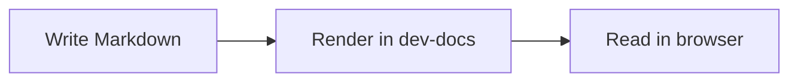

# Markdown tutorial: what it is, the grammar, and how it renders

## Table of Contents

- [What is Markdown?](#what-is-markdown)
- [Why use Markdown?](#why-use-markdown)
- [Core grammar](#core-grammar)
- [How to read Markdown source vs rendered output](#how-to-read-markdown-source-vs-rendered-output)
- [How Markdown renders in PMate dev-docs](#how-markdown-renders-in-pmate-dev-docs)
- [What to use carefully](#what-to-use-carefully)
- [Next step](#next-step)

## What is Markdown?

Markdown is a lightweight text format for writing structured documents with plain text.

Instead of clicking toolbar buttons in a rich-text editor, you write a few small syntax markers:

- `#` for headings
- `-` or `1.` for lists
- `**text**` for bold text
- `` `code` `` for inline code
- `[label](url)` for links

The source stays readable even before it is rendered.

Example source:

```md
# Hello Markdown

This is **bold**, this is *italic*, and this is a [link](https://example.com).
```

Rendered idea:

# Hello Markdown

This is **bold**, this is *italic*, and this is a [link](https://example.com).

## Why use Markdown?

Markdown is useful because it is:

- fast to write
- easy to review in Git
- friendly to copy, diff, and version control
- portable across many documentation systems
- readable even as raw text

For docs work, Markdown usually gives the best balance between simplicity and structure.

## Core grammar

### Headings

Use `#` through `######` for headings.

```md
# Heading 1
## Heading 2
### Heading 3
```

Rendered:

# Heading 1
## Heading 2
### Heading 3

### Paragraphs and line breaks

Write normal text as paragraphs. Leave a blank line between paragraphs.

```md
This is the first paragraph.

This is the second paragraph.
```

Rendered:

This is the first paragraph.

This is the second paragraph.

If you want a visible forced break inside one paragraph, use HTML `<br />` carefully:

```md
Line one.<br />
Line two.
```

Rendered:

Line one.<br />
Line two.

### Emphasis

```md
*italic*
**bold**
***bold italic***
```

Rendered:

*italic*  
**bold**  
***bold italic***

### Unordered lists

```md
- first item
- second item
- third item
```

Rendered:

- first item
- second item
- third item

### Ordered lists

```md
1. first step
2. second step
3. third step
```

Rendered:

1. first step
2. second step
3. third step

### Links

```md
[OpenAI](https://openai.com/)
```

Rendered:

[OpenAI](https://openai.com/)

### Images

Images use a similar shape to links, but start with `!`.

```md

```

In PMate docs, use images only when the asset is stable and appropriate for documentation.

### Blockquotes

```md
> Markdown is plain text first, rendered output second.
```

Rendered:

> Markdown is plain text first, rendered output second.

### Inline code

Use backticks for short code, file paths, commands, and identifiers.

```md
Run `pnpm install` in `apps/dev-docs`.
```

Rendered:

Run `pnpm install` in `apps/dev-docs`.

### Fenced code blocks

Use triple backticks for larger code examples. Add a language label when possible.

```md
```bash
pnpm --filter @pmate/dev-docs build
```
```

Rendered:

```bash
pnpm --filter @pmate/dev-docs build
```

### Horizontal rules

Use three dashes to separate sections.

```md
---
```

Rendered:

---

### Mermaid diagrams

This docs app supports Mermaid through the current render pipeline.

Source:

````md

````

Rendered:


## How to read Markdown source vs rendered output

When learning Markdown, look at both forms:

1. the source text you type
2. the rendered result users read

A good tutorial should show both, because Markdown is about the mapping between them.

Example:

Source:

```md
## Release steps

1. Build the app.
2. Review the output.
3. Deploy after approval.
```

Rendered:

## Release steps

1. Build the app.
2. Review the output.
3. Deploy after approval.

## How Markdown renders in PMate dev-docs

Inside `pmate/pmate-mono/apps/dev-docs`:

1. Markdown files are stored under `docs/en/...` and `docs/cn/...`.
2. The docs app imports those files in `src/pages/docsContent.tsx`.
3. The page is rendered by the existing Vike + React shell.
4. Code blocks are highlighted by the current renderer.
5. Mermaid diagrams are processed by the current pipeline.

That means this docs site is not just storing raw text files. It is turning Markdown into a real documentation page inside the PMate app.

## What to use carefully

Not every Markdown flavor supports the same extensions.

For this docs app:

- headings, paragraphs, emphasis, lists, links, quotes, inline code, fenced code blocks, and Mermaid are safe choices
- features such as tables, task lists, and platform-specific callouts depend on extra plugins or styling
- raw HTML may work in some cases, but should be used sparingly

Recommendation:

- prefer the simple core grammar first
- add advanced syntax only after verifying it renders well in `apps/dev-docs`

## Next step

The fastest way to learn Markdown is:

1. write a small example
2. preview the rendered result
3. compare the source and output
4. repeat with one new grammar feature at a time

If you want to continue, the next useful exercise is to create a short guide page using headings, lists, links, code blocks, and one Mermaid diagram.
