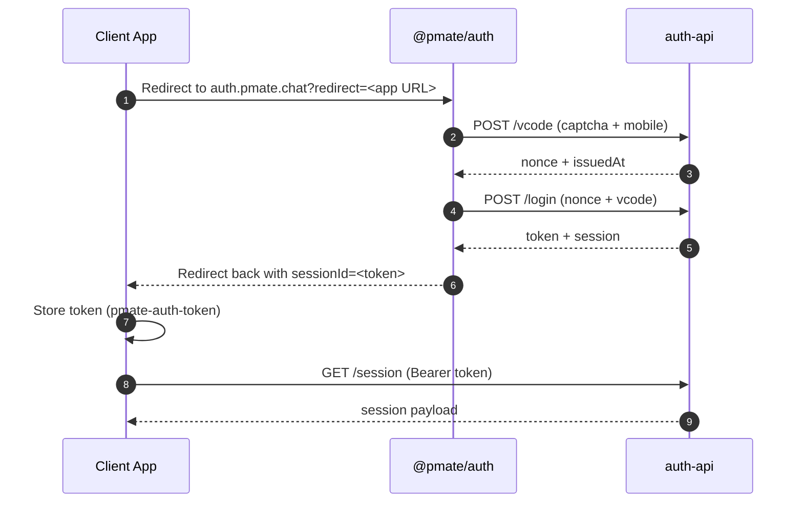

# Auth Integration Guide (auth-api + @pmate/auth)

This document describes how a new app integrates with the auth backend (`auth-api`) and the hosted login UI (`@pmate/auth`).

## Background/背景

Auth integration needs to coordinate UI, session tokens, and service calls across apps and environments. Without a clear flow, teams often re-implement the same login logic and end up with mismatched redirect behavior or token handling.

This guide exists to align how we use `auth-api` and the hosted login UI, and to clarify the recommended paths for app integration so that behavior stays consistent across products.

## Overview

- `auth-api` is the HTTP service that issues SMS codes, verifies login, and manages sessions.
- `@pmate/auth` is the login UI app that handles SMS + captcha, then redirects back with a session token.
- Client apps can either call `auth-api` directly (via `@pmate/auth-client` or `@pmate/sdk`) or redirect users to `@pmate/auth` for login.

## auth-api Design (apps/auth-api)

### Entry and middleware

- Service entry: `apps/auth-api/src/index.ts`.
- CORS allows `localhost` and `*.skedo.cn` / `*.pmate.chat` origins.
- Session tokens are set as httpOnly cookies (domain: `pmate.chat`).

### Key endpoints

- `POST /vcode` issues SMS codes with captcha validation.
- `POST /captcha/verify` validates captcha.
- `POST /login` verifies the SMS code, creates account if needed, and returns `{ token, session, identity }`.
- `GET /session` returns session payload if token is valid.
- `POST /logout` invalidates the session.
- Profile endpoints: `GET /profiles`, `POST /profile`, `PUT /profile`, `GET /find`.

### Required services

`auth-api` uses helpers from `@pmate/service-core` for:
- SMS code issuance and captcha verification.
- Account creation / lookup.
- Session creation and storage.

## @pmate/auth Design (apps/auth)

### Login flow

- UI entry: `apps/auth/src/pages/login.tsx`.
- Supports `?redirect=<url>` query param.
- After login, it redirects to the target URL with `sessionId=<token>` appended.
- It also stores `pmate-auth-token` in `localStorage` for quick re-redirects.

### How it requests login

- Requests SMS code via `@pmate/auth-client` (`apps/auth/src/atom/auth.ts`).
- Performs login via `AccountService.login` from `@pmate/sdk` (`apps/auth/src/component/LoginForm.tsx`).
- Captcha is required before SMS code issuance (Aliyun captcha).

## Integrating a New App

### Option A: Redirect to @pmate/auth (recommended for web)

1. Send users to the hosted login UI:
   - `https://auth.pmate.chat?redirect=<encoded_return_url>`
2. On return, read `sessionId` from the URL and store it as the auth token.
3. Use the token to call auth-protected endpoints or `GET /session` to hydrate user state.

Reference implementation: `packages/account-sdk/src/components/AuthProviderV2.tsx`.

### @pmate/account-sdk peer deps (published)

When consuming `@pmate/account-sdk` from npm, you need to provide these peer dependencies:

- `react`
- `react-router-dom`
- `jotai`
- `jotai-family`

### Option B: Call auth-api directly

Use either:
- `@pmate/auth-client` for a thin client: `packages/auth-client/src/index.ts`.
- `@pmate/sdk` `AccountService` for app integration: `packages/sdk/src/api/AccountService.ts`.

Minimum flow:
1. `POST /vcode` with `mobile`, `purpose`, and captcha token.
2. `POST /login` with `{ nonce, issuedAt, body: { type: "sms", mobile, vcode } }`.
3. Store `token` (e.g., `pmate-auth-token`) and use it on future calls.
4. Optional: `GET /session` to restore identity on page refresh.

### Required env config (frontend)

- `VITE_PUBLIC_AUTH_SERVER_ENDPOINT` (auth-api base URL).
- `VITE_PUBLIC_ACCOUNT_SERVICE` (if your app uses account service APIs).

## Notes

- `auth-api` enforces captcha for SMS code issuance.
- In restricted test mode, `x-test` only works with `test_` mobiles, `POST /vcode` still issues the required nonce, and `POST /login` expects the fixed test vcode `888888`.
- Session cookies are set for `pmate.chat` domain, so cross-domain behavior depends on deployment domain.
- If you use the redirect flow, always clear `sessionId` from the URL after storing it.
