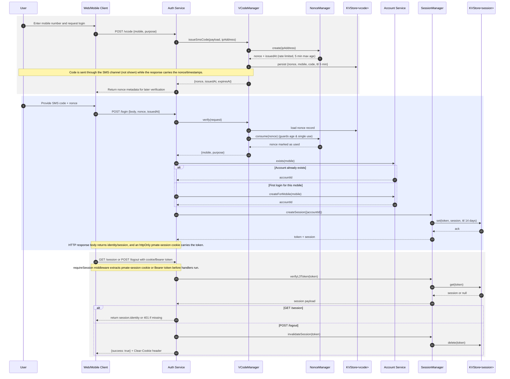

# Auth Flow

The SMS-based login handled in `apps/service/src/entry/auth.server.ts` builds on the helpers under `apps/service/src/util/auth`. The diagram below stitches together the `/vcode`, `/login`, `/session`, and `/logout` endpoints, just as they are wired in the service today.

## Sequence Diagram

## Key Files

- `apps/service/src/entry/auth.server.ts` – wires the HTTP routes, including cookie handling.
- `apps/service/src/util/auth/VCodeManager.ts` – manages SMS verification codes (5-minute TTL) backed by `KVStore.vcodeStore`.
- `apps/service/src/util/auth/NonceManager.ts` – enforces IP rate limiting and one-time nonce consumption.
- `apps/service/src/util/auth/SessionManager.ts` – persists pmate-session tokens for 14 days in Redis (when available) via `KVStore.sessionStore`.
